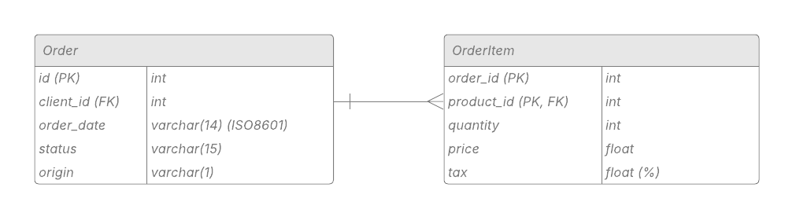

# Projeto ETL

### Disclaimer

O conteúdo a seguir foi diretamente replicado do material da disciplina Programação Funcional, conduzido pelo [Prof. Raul Ikeda](https://www.insper.edu.br/pt/docentes/raul-ikeda-gomes-da-silva). Todos os créditos são atribuídos a ele.

## FP no contexto ETL

Devido às características do paradigma funcional, como imutabilidade, funções puras e funções de ordem superior (higher-order functions), a programação funcional se torna uma excelente abordagem para a implementação de sistemas ETL. A utilização de higher-order functions possibilita a transformação de dados por meio de operações como `map`, `reduce` e `filter`. Além disso, ao empregar funções puras e imutáveis, a composição funcional facilita a paralelização do processamento, tornando a abordagem altamente escalável em cenários de Big Data. 

No entanto, é necessário lidar com efeitos colaterais (side effects), pois as etapas de extração e armazenamento envolvem interações com recursos externos. Dessa forma, o isolamento entre funções puras e impuras se torna essencial para garantir a previsibilidade e a manutenibilidade do sistema.

## Objetivo

O objetivo deste projeto ETL é processar dados a partir de um recurso (um arquivo CSV), aplicando transformações e armazenando o resultado em um outro recurso (um novo arquivo CSV). 

O projeto se baseia em duas tabelas que representam uma pequena parte de um software de gestão: uma tabela de pedidos e outra contendo os itens de cada pedido.

Em um cenário real, o acesso direto ao banco de dados pode ser impraticável por razões de segurança e desempenho. Por isso, um processo diário extrai os dados relevantes e gera uma cópia em um arquivo compartilhado.

O objetivo final é fornecer os dados processados ao gestor, que utilizará essas informações para alimentar um dashboard de visualização agregada dos pedidos.

## A Entrada

Diariamente, dois arquivos estarão disponíveis para processamento. 

O primeiro arquivo contém os dados da tabela `Order`, que registra os pedidos selecionados para o dia. Essa tabela possui uma chave primária (`id`), que identifica cada pedido de forma única. Além do identificador, ela contém o id do cliente (`client_id`), a data do pedido (`order_date`), o `status` do pedido e a `origin` do pedido. As ordens podem ter status de `pending`, `complete` ou `cancelled`. Já a origem pode ser `P` para physical ou `O` para online, ou seja, via web. 

O segundo arquivo contém os dados da tabela `OrderItem` , que registra os itens de cada pedido. Uma mesma ordem pode ter múltiplos itens, e a relação é estabelecida pelo campo `order_id`. Esse campo, em conjunto com o `product_id` , formam a chave primária (identificador único) da tabela. Além disso há também a quantidade (`quantity`), preço pago no momento da compra (`price`) e o imposto do produto em formato percentual (`tax`). Como o preço de venda de um produto pode variar ao longo do tempo, é essencial armazenar o preço acordado no pedido.

As tabelas `Clients` e `Products` não são fornecidas, pois não são relevantes para o dashboard de visualização agregada.

O modelo ER fica como a seguir:



## Saída Esperada

O gestor gostaria de receber um arquivo CSV que contém 3 campos: `order_id`, `total_amount` e `total_taxes`. `total amount` contém o total do pedido, ou seja, o somatório da receita de todos os itens de um pedido. A receita é calculada através da multiplicação do preço pela quantidade. `total_taxes` contém o somatório do imposto pago em todos os itens. Considerar que o imposto é o percentual mutiplicado pela receita de cada item. O gestor gostaria de poder parametrizar a saída para `status` e `origin` específicos dos pedidos.

**Exemplo**: 
 - `status`: `complete` 
 - `origin` : online (`O`).

**Saída em CSV**:
```
order_id,total_amount,total_taxes
1,1345.88,20.34
5,34.54,2.35
14,334.44,30.4
...
```

## Requisitos

### Requisitos Básicos

1. O projeto precisa ser feito em OCaml.
2. Para calcular a saída, é necessário utilizar `map`, `reduce` e `filter`.
3. O código deve conter funções para leitura e escrita de arquivos CSV. Isso gerará funções impuras.
4. Separar as funções impuras das funções puras nos arquivos do projeto.
5. A entrada precisa ser carregada em uma estrutura de lista de `Records`.
6. É obrigatório o uso de `Helper Functions` para carregar os campos em um `Record`.
7. É necessário escrever um relatório do projeto, indicando como as etapas foram construídas. Isso é semelhante a um roteiro para alguém que iria refazer o projeto no futuro. Você deve declarar o uso ou não de IA Generativa nesse relatório.

### Requisitos Opcionais

1. Ler os dados de entrada em um arquivo estático na internet (exposto via http).
2. Salvar os dados de saída em um Banco de Dados SQLite.
3. É possível fazer fazer o tratamento das tabelas de entrada em separado. Mas é desejável realizar o tratamento dos dados conjuntamente via operação de `inner join`. Ou seja, juntar as tabelas antes de iniciar as conversões e montagem do `Record`.
4. Organizar o projeto ETL utilizando `dune`.
5. Documentar todas as funções geradas via formato `docstring`.
6. Realizar uma saída adicional que contém a média de receita e impostos pagos agrupados por mês e ano.
7. Gerar arquivos de testes **completos** para as funções puras.